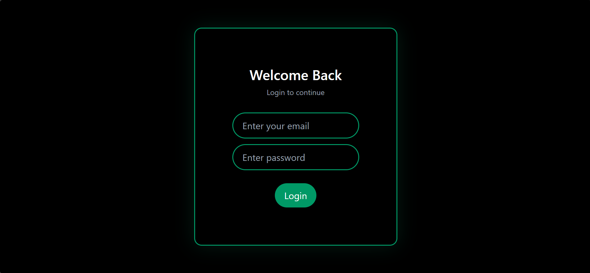
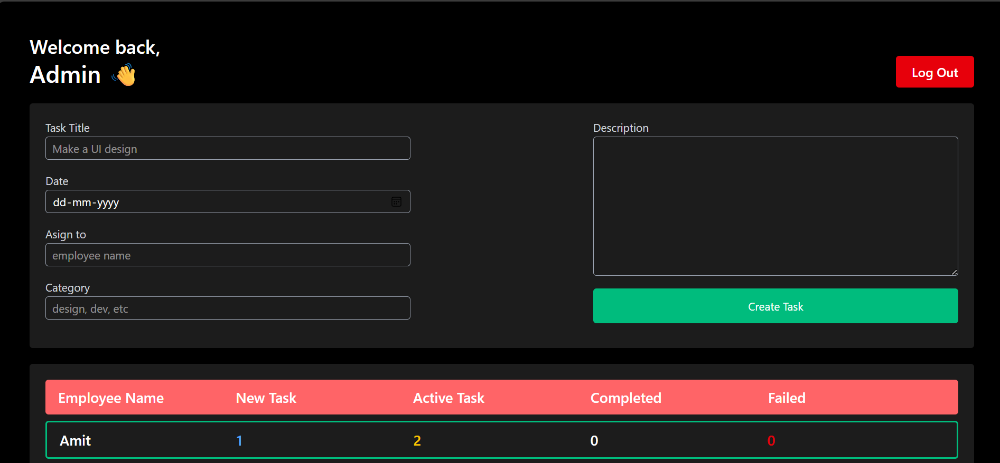

# 🧑‍💼 Employee Management System (EMS)

A modern **Employee Management System dashboard** built using **React.js**.  
It provides employees with a clean, intuitive interface to manage and track tasks efficiently.

---

## 🚀 Features

- 🔐 **Login System**
- 📊 **Employee Dashboard**
- 🆕 View **New Tasks**
- ✅ Track **Completed Tasks**
- 👍 See **Accepted Tasks**
- ❌ Identify **Failed Tasks**
- 🗂️ Task cards with status indicators
- 🎨 Clean & responsive UI (dark theme)
- 🚪 Logout functionality

---

## 🛠️ Tech Stack

- **React.js**
- **Vite**
- **JavaScript (ES6+)**
- **CSS / Tailwind CSS**
- **ESLint**

---

## 📸 Screenshots

### 🔑 Login Page
  

### 📊 Employee Dashboard
 

### 🛠️ Admin Dashboard
 

